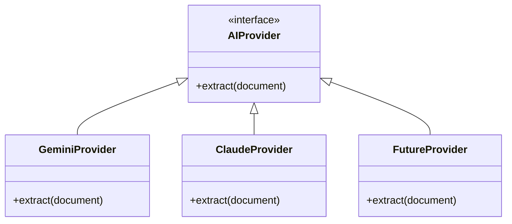
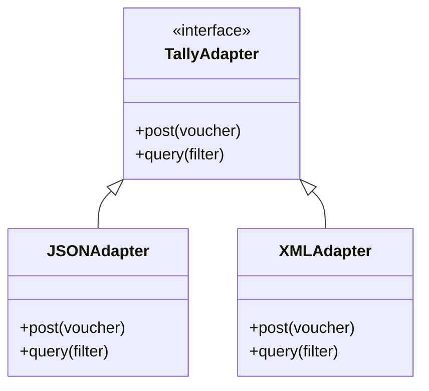

# WAAST360 Architecture

## Core Architectural Directives
- **No throwaway logic:** Lite must use the Prime-grade foundation.
- **Provider Abstraction:** Critical external dependencies must be abstracted.

## AI Provider Abstraction

## Tally Adapter Abstraction

## Key Subsystems
1. **WAAST360 Core API:** Orchestrates proposals, approvals, and AI extraction.
2. **WAAST360 Web UI:** The user interface for interacting with proposals.
3. **WAAST360 Bridge:** A local agent that sits next to Tally and securely executes commands.
