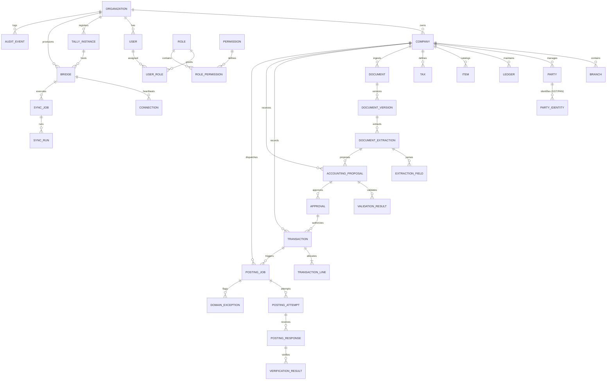

# WAAST360 Phase 2B — Entity-Relationship (ER) & Domain Relationship Map

## 1. Architectural & Accounting Foundations
1. **Identifier Strategy**: 
   - **Internal Entity ID**: UUIDv7 (time-ordered UUIDs using Python 3.14 `uuid.uuid7()`).
   - **Business References**: Dedicated fields (e.g., `voucher_number`, `invoice_number`, `document_number`).
   - **Tally Authority References**: Tally-assigned identifiers (e.g., `tally_guid`, `tally_master_id`, `tally_alter_id`) are preserved intact and never conflated with WAAST360 IDs.
2. **Multi-Tenancy**:
   - Explicit tenant boundaries: Top-level `organization_id` (Tenant) and `company_id` (Accounting Entity).
   - Compound indexes on `(organization_id, company_id, ...)`.
3. **Data Integrity & Auditability**:
   - `created_at`, `updated_at` standardized across all tables with UTC timestamps.
   - Soft-deletion (`is_deleted`, `deleted_at`) for master and operational records.
   - Foreign keys to accounting records use `ON DELETE RESTRICT` to prevent casual deletion of financial history.
   - `audit_events` table is append-only and immutable.

---

## 2. Mermaid Entity-Relationship Diagram

---

## 3. Entity Specification

### 3.1 Tenant & Security Cluster
- **`organizations`**
  - `id` (UUID PK, UUIDv7)
  - `legal_name` (VARCHAR 255)
  - `slug` (VARCHAR 100, UNIQUE)
  - `is_active` (BOOLEAN, default True)
  - `created_at`, `updated_at`
- **`companies`**
  - `id` (UUID PK, UUIDv7)
  - `organization_id` (UUID FK -> organizations.id)
  - `legal_name` (VARCHAR 255)
  - `trade_name` (VARCHAR 255)
  - `pan` (VARCHAR 20)
  - `gstin` (VARCHAR 20)
  - `tally_company_name` (VARCHAR 255)
  - `currency` (VARCHAR 10, default 'INR')
  - `financial_year_start` (DATE)
  - `is_deleted`, `deleted_at`, `created_at`, `updated_at`
- **`branches`**
  - `id` (UUID PK, UUIDv7)
  - `organization_id` (UUID FK)
  - `company_id` (UUID FK -> companies.id)
  - `branch_code` (VARCHAR 50)
  - `name` (VARCHAR 255)
  - `state_code` (VARCHAR 10)
  - `gstin` (VARCHAR 20)
  - `is_deleted`, `deleted_at`, `created_at`, `updated_at`
- **`users`**
  - `id` (UUID PK, UUIDv7)
  - `organization_id` (UUID FK)
  - `email` (VARCHAR 255, UNIQUE)
  - `full_name` (VARCHAR 255)
  - `hashed_password` (VARCHAR 255)
  - `is_active` (BOOLEAN)
  - `created_at`, `updated_at`
- **`roles`**
  - `id` (UUID PK, UUIDv7)
  - `organization_id` (UUID FK, nullable for system roles)
  - `name` (VARCHAR 100)
  - `description` (TEXT)
  - `created_at`, `updated_at`
- **`permissions`**
  - `id` (UUID PK, UUIDv7)
  - `code` (VARCHAR 100, UNIQUE, e.g. `proposal:approve`, `tally:post`)
  - `description` (TEXT)
  - `created_at`
- **`user_roles`**
  - `user_id` (UUID FK -> users.id)
  - `role_id` (UUID FK -> roles.id)
  - Primary Key: `(user_id, role_id)`
- **`role_permissions`**
  - `role_id` (UUID FK -> roles.id)
  - `permission_id` (UUID FK -> permissions.id)
  - Primary Key: `(role_id, permission_id)`

---

### 3.2 Tally & Bridge Cluster
- **`tally_instances`**
  - `id` (UUID PK, UUIDv7)
  - `organization_id` (UUID FK)
  - `company_id` (UUID FK, nullable)
  - `instance_name` (VARCHAR 100)
  - `host` (VARCHAR 255, default '127.0.0.1')
  - `port` (INTEGER, default 9000)
  - `tally_version` (VARCHAR 100)
  - `is_active` (BOOLEAN)
  - `created_at`, `updated_at`
- **`bridges`**
  - `id` (UUID PK, UUIDv7)
  - `organization_id` (UUID FK)
  - `tally_instance_id` (UUID FK -> tally_instances.id)
  - `bridge_client_id` (VARCHAR 100, UNIQUE)
  - `api_key_hash` (VARCHAR 255)
  - `os_platform` (VARCHAR 100)
  - `status` (VARCHAR 50: `ONLINE`, `OFFLINE`, `ERROR`)
  - `last_heartbeat_at` (TIMESTAMPTZ)
  - `created_at`, `updated_at`
- **`connections`**
  - `id` (UUID PK, UUIDv7)
  - `bridge_id` (UUID FK -> bridges.id)
  - `session_id` (VARCHAR 100)
  - `ip_address` (VARCHAR 50)
  - `connected_at` (TIMESTAMPTZ)
  - `disconnected_at` (TIMESTAMPTZ, nullable)
  - `disconnect_reason` (TEXT, nullable)
- **`sync_jobs`**
  - `id` (UUID PK, UUIDv7)
  - `organization_id` (UUID FK)
  - `company_id` (UUID FK)
  - `sync_type` (VARCHAR 50: `LEDGERS`, `ITEMS`, `PARTIES`, `TAXES`, `FULL`)
  - `status` (VARCHAR 50: `PENDING`, `RUNNING`, `SUCCESS`, `FAILED`)
  - `cron_expression` (VARCHAR 50, nullable)
  - `created_at`, `updated_at`
- **`sync_runs`**
  - `id` (UUID PK, UUIDv7)
  - `sync_job_id` (UUID FK -> sync_jobs.id)
  - `started_at` (TIMESTAMPTZ)
  - `completed_at` (TIMESTAMPTZ, nullable)
  - `records_pulled` (INTEGER, default 0)
  - `records_updated` (INTEGER, default 0)
  - `status` (VARCHAR 50)
  - `error_message` (TEXT, nullable)

---

### 3.3 Master Data Cluster
- **`parties`**
  - `id` (UUID PK, UUIDv7)
  - `organization_id` (UUID FK)
  - `company_id` (UUID FK)
  - `tally_guid` (VARCHAR 255, nullable, indexed)
  - `tally_master_id` (INTEGER, nullable)
  - `name` (VARCHAR 255)
  - `party_type` (VARCHAR 50: `CREDITOR`, `DEBTOR`)
  - `parent_group` (VARCHAR 255)
  - `is_active` (BOOLEAN, default True)
  - `is_deleted`, `deleted_at`, `created_at`, `updated_at`
- **`party_identities`**
  - `id` (UUID PK, UUIDv7)
  - `party_id` (UUID FK -> parties.id)
  - `gstin` (VARCHAR 20, indexed)
  - `pan` (VARCHAR 20, indexed)
  - `state_name` (VARCHAR 100)
  - `registration_type` (VARCHAR 50)
  - `address_line1` (TEXT)
  - `pincode` (VARCHAR 20)
  - `created_at`, `updated_at`
- **`ledgers`**
  - `id` (UUID PK, UUIDv7)
  - `organization_id` (UUID FK)
  - `company_id` (UUID FK)
  - `tally_guid` (VARCHAR 255, nullable, indexed)
  - `tally_master_id` (INTEGER, nullable)
  - `name` (VARCHAR 255)
  - `parent_group` (VARCHAR 255)
  - `opening_balance` (NUMERIC(18, 4), default 0.0)
  - `is_deleted`, `deleted_at`, `created_at`, `updated_at`
- **`items`**
  - `id` (UUID PK, UUIDv7)
  - `organization_id` (UUID FK)
  - `company_id` (UUID FK)
  - `tally_guid` (VARCHAR 255, nullable, indexed)
  - `tally_master_id` (INTEGER, nullable)
  - `name` (VARCHAR 255)
  - `hsn_sac_code` (VARCHAR 50)
  - `uom` (VARCHAR 50)
  - `is_deleted`, `deleted_at`, `created_at`, `updated_at`
- **`taxes`**
  - `id` (UUID PK, UUIDv7)
  - `organization_id` (UUID FK)
  - `company_id` (UUID FK)
  - `name` (VARCHAR 255)
  - `tax_type` (VARCHAR 50: `CGST`, `SGST`, `IGST`, `TDS`, `TCS`)
  - `rate_percentage` (NUMERIC(5, 2))
  - `ledger_id` (UUID FK -> ledgers.id, nullable)
  - `created_at`, `updated_at`

---

### 3.4 Document Ingestion & AI Cluster
- **`documents`**
  - `id` (UUID PK, UUIDv7)
  - `organization_id` (UUID FK)
  - `company_id` (UUID FK)
  - `document_number` (VARCHAR 100) -- Original reference
  - `file_name` (VARCHAR 255)
  - `file_type` (VARCHAR 50: `PDF`, `PNG`, `JPEG`, etc.)
  - `file_size_bytes` (BIGINT)
  - `storage_path` (TEXT)
  - `sha256_checksum` (VARCHAR 64)
  - `status` (VARCHAR 50: `UPLOADED`, `EXTRACTED`, `PROPOSED`, `POSTED`, `REJECTED`)
  - `is_deleted`, `deleted_at`, `created_at`, `updated_at`
- **`document_versions`**
  - `id` (UUID PK, UUIDv7)
  - `document_id` (UUID FK -> documents.id)
  - `version_number` (INTEGER, default 1)
  - `storage_path` (TEXT)
  - `sha256_checksum` (VARCHAR 64)
  - `created_at`
- **`document_extractions`**
  - `id` (UUID PK, UUIDv7)
  - `document_version_id` (UUID FK -> document_versions.id)
  - `ai_provider` (VARCHAR 50: `GeminiProvider`, `ClaudeProvider`)
  - `model_name` (VARCHAR 100)
  - `raw_response_json` (JSONB)
  - `confidence_score` (NUMERIC(5, 4))
  - `processing_time_ms` (INTEGER)
  - `created_at`
- **`extraction_fields`**
  - `id` (UUID PK, UUIDv7)
  - `document_extraction_id` (UUID FK -> document_extractions.id)
  - `field_name` (VARCHAR 100: `invoice_number`, `invoice_date`, `vendor_name`, `vendor_gstin`, `total_amount`, etc.)
  - `field_value_text` (TEXT)
  - `confidence_score` (NUMERIC(5, 4))
  - `bounding_box` (JSONB, nullable)
  - `created_at`

---

### 3.5 Accounting Proposal, Validation & Approval Cluster
- **`accounting_proposals`**
  - `id` (UUID PK, UUIDv7)
  - `organization_id` (UUID FK)
  - `company_id` (UUID FK)
  - `document_id` (UUID FK -> documents.id)
  - `document_extraction_id` (UUID FK -> document_extractions.id)
  - `voucher_type` (VARCHAR 50: `Purchase`, `Payment`, `Journal`, `Sales`)
  - `proposed_date` (DATE)
  - `party_ledger_id` (UUID FK -> ledgers.id, nullable)
  - `total_amount` (NUMERIC(18, 4))
  - `tax_amount` (NUMERIC(18, 4))
  - `narration` (TEXT)
  - `status` (VARCHAR 50: `DRAFT`, `VALIDATED`, `FLAGGED`, `APPROVED`, `POSTED`, `REJECTED`)
  - `is_deleted`, `deleted_at`, `created_at`, `updated_at`
- **`validation_results`**
  - `id` (UUID PK, UUIDv7)
  - `accounting_proposal_id` (UUID FK -> accounting_proposals.id)
  - `rule_code` (VARCHAR 100: `DUPLICATE_INVOICE_CHECK`, `TAX_CALCULATION_MATCH`, `LEDGER_EXISTS_CHECK`)
  - `severity` (VARCHAR 20: `INFO`, `WARNING`, `ERROR`, `BLOCKER`)
  - `is_passed` (BOOLEAN)
  - `message` (TEXT)
  - `details` (JSONB, nullable)
  - `created_at`
- **`approvals`**
  - `id` (UUID PK, UUIDv7)
  - `accounting_proposal_id` (UUID FK -> accounting_proposals.id)
  - `user_id` (UUID FK -> users.id)
  - `action` (VARCHAR 50: `APPROVED`, `REJECTED`, `MODIFIED_AND_APPROVED`)
  - `comments` (TEXT, nullable)
  - `approval_signature` (VARCHAR 255, crypto hash)
  - `approved_at` (TIMESTAMPTZ)

---

### 3.6 Transaction & Posting Cluster
- **`transactions`**
  - `id` (UUID PK, UUIDv7)
  - `organization_id` (UUID FK)
  - `company_id` (UUID FK)
  - `accounting_proposal_id` (UUID FK -> accounting_proposals.id)
  - `voucher_type` (VARCHAR 50)
  - `voucher_date` (DATE)
  - `reference_number` (VARCHAR 100) -- e.g. Supplier invoice number
  - `total_amount` (NUMERIC(18, 4))
  - `narration` (TEXT)
  - `created_at`, `updated_at`
- **`transaction_lines`**
  - `id` (UUID PK, UUIDv7)
  - `transaction_id` (UUID FK -> transactions.id)
  - `line_number` (INTEGER)
  - `ledger_id` (UUID FK -> ledgers.id)
  - `is_debit` (BOOLEAN)
  - `amount` (NUMERIC(18, 4))
  - `item_id` (UUID FK -> items.id, nullable)
  - `quantity` (NUMERIC(18, 4), nullable)
  - `rate` (NUMERIC(18, 4), nullable)
  - `created_at`
- **`posting_jobs`**
  - `id` (UUID PK, UUIDv7)
  - `organization_id` (UUID FK)
  - `company_id` (UUID FK)
  - `transaction_id` (UUID FK -> transactions.id)
  - `bridge_id` (UUID FK -> bridges.id)
  - `status` (VARCHAR 50: `QUEUED`, `IN_FLIGHT`, `COMPLETED`, `FAILED`, `CANCELLED`)
  - `scheduled_at` (TIMESTAMPTZ)
  - `completed_at` (TIMESTAMPTZ, nullable)
  - `created_at`, `updated_at`
- **`posting_attempts`**
  - `id` (UUID PK, UUIDv7)
  - `posting_job_id` (UUID FK -> posting_jobs.id)
  - `attempt_number` (INTEGER)
  - `payload_format` (VARCHAR 20: `XML`, `JSON`)
  - `payload_sent` (TEXT)
  - `sent_at` (TIMESTAMPTZ)
  - `created_at`
- **`posting_responses`**
  - `id` (UUID PK, UUIDv7)
  - `posting_attempt_id` (UUID FK -> posting_attempts.id)
  - `status_code` (INTEGER)
  - `raw_response` (TEXT)
  - `tally_voucher_guid` (VARCHAR 255, nullable)
  - `tally_master_id` (INTEGER, nullable)
  - `tally_voucher_number` (VARCHAR 100, nullable)
  - `is_success` (BOOLEAN)
  - `error_description` (TEXT, nullable)
  - `received_at` (TIMESTAMPTZ)
- **`verification_results`**
  - `id` (UUID PK, UUIDv7)
  - `posting_response_id` (UUID FK -> posting_responses.id)
  - `is_verified` (BOOLEAN)
  - `tally_read_voucher_number` (VARCHAR 100, nullable)
  - `read_back_payload` (JSONB, nullable)
  - `verification_error` (TEXT, nullable)
  - `verified_at` (TIMESTAMPTZ)

---

### 3.7 Exceptions & Audit Cluster
- **`domain_exceptions`** (System & Domain Exceptions)
  - `id` (UUID PK, UUIDv7)
  - `organization_id` (UUID FK)
  - `company_id` (UUID FK, nullable)
  - `entity_type` (VARCHAR 100)
  - `entity_id` (UUID, nullable)
  - `exception_category` (VARCHAR 50: `VALIDATION_FAILURE`, `BRIDGE_COMMUNICATION_ERROR`, `TALLY_REJECTION`, `TIMEOUT`)
  - `severity` (VARCHAR 20: `LOW`, `MEDIUM`, `HIGH`, `CRITICAL`)
  - `error_message` (TEXT)
  - `stack_trace` (TEXT, nullable)
  - `is_resolved` (BOOLEAN, default False)
  - `resolved_by_user_id` (UUID FK -> users.id, nullable)
  - `resolved_at` (TIMESTAMPTZ, nullable)
  - `created_at`
- **`audit_events`** (Immutable Audit Trail)
  - `id` (UUID PK, UUIDv7)
  - `organization_id` (UUID FK)
  - `company_id` (UUID FK, nullable)
  - `actor_type` (VARCHAR 50: `USER`, `AI_AGENT`, `BRIDGE`, `SYSTEM_RULE`)
  - `actor_id` (VARCHAR 255)
  - `action` (VARCHAR 100: `DOCUMENT_UPLOADED`, `AI_EXTRACTION_COMPLETED`, `PROPOSAL_CREATED`, `PROPOSAL_APPROVED`, `TALLY_POSTED`, `READ_BACK_VERIFIED`)
  - `entity_type` (VARCHAR 100)
  - `entity_id` (UUID)
  - `changes` (JSONB, nullable)
  - `metadata` (JSONB, nullable)
  - `ip_address` (VARCHAR 50, nullable)
  - `recorded_at` (TIMESTAMPTZ, default UTC NOW)
